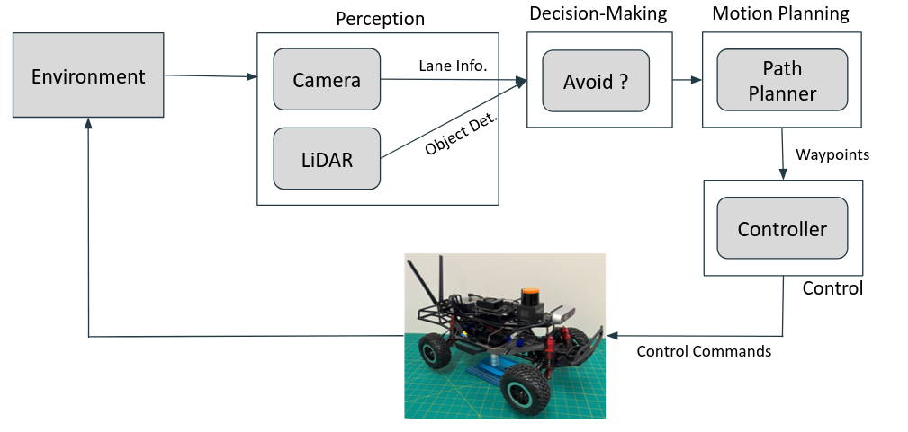

# Autonomous F1-Tenth System for Lane Following and Dynamic Obstacle Avoidance

## Overview
This project focuses on implementing an autonomous system for an F1-Tenth car capable of lane following and obstacle avoidance. It is a part of the **ECE484 Principle of Safe Autonomy** course at University of Illinois Urbana-Champaign. The goal is to create a robust and efficient solution that enables the vehicle to navigate safely around obstacles while maintaining its lane.

The setup of the environment can be found [here](https://publish.illinois.edu/robotics-autonomy-resources/f1tenth/).

[F1-Tenth Official Page](https://f1tenth.org/)

## Table of Contents
- [Project Overview](#overview)
- [Motivation](#motivation)
- [Features](#features)
- [System Architecture](#system-architecture)
- [Implementation Details](#implementation-details)
- [Installation and Setup](#installation-and-setup)
- [Usage](#usage)
- [Results](#results)
- [Future Work](#future-work)
- [Contributors](#contributors)
- [Acknowledgements](#acknowledgements)

## Motivation
Giving recent developments in autonomous driving, pedestrian avoiding has always be a top concern as safety is the top priority. Due to the sensor reliability and unpredictability of the road situation, the topic is still active and under research. 

The F1-Tenth platform offers a hands-on opportunity to explore and implement solutions for safe autonomy scenarios. This project aims to develop a functional and scaled-down version of an autonomous system that can serve as a baseline for more advanced algorithms in safe autonomy.

## Features
- **Lane Following**: Utilize a monocular camera to detect lanes and follow using a pure pursuit controller
- **Obstacle Avoidance**: Detect and avoid static and dynamic obstacles using camera and LiDAR


## System Architecture


The architecture of this project is divided into the following modules:
1. **Perception**: Processe sensor data (e.g., LiDAR, camera) to identify lanes and obstacles
2. **Decision-Making**: Determine whether to switch from lane following to obstacle avoidance mode
3. **Motion Planning**: Determine the optimal path based on lane information, ensuring safe navigation
4. **Control**: Execute the planned path by sending twist commands to the car's controller


## Implementation Details
TBD


## Installation and Setup
### Prerequisites
- Python 3.x
- Numpy 1.4 +
- OpenCV 3.0 +
- A functional F1-Tenth car with ROS Noetic set up

### Installation Steps
- Place the package `f1tenth_control/vicon_control` in the ROS workspace on the F1-Tenth car
- Place the package `f1tenth_system/ackermann_msgs` in the workspace
- Rebuild the workspace
    

## Usage
### Running the System
1. Launch the ROS nodes on the F1-Tenth car to publish camera and LiDAR topics
2. Run the LaneFollower node:
    ```bash
    cd vicon_control/scripts
    python3 lanefollower.py
    ```


## Results
### Qualitative Results
- [Lane following](https://drive.google.com/file/d/1f9NQm4eKVa1SLJ_fwDYRuE5nmd7A-tVC/view?usp=sharing)
- [Obstacle avoidance](https://drive.google.com/file/d/1kjLTOfaxQiwLivaiRInXGz8rtO7P9P3L/view?usp=sharing)

### Quantitative Results
#### Lane Following Robustness
| Target Velocity| Time for a Lap  | % Fail Detect   | Max Number of Laps |
|---------|-----------------|-----------------|-----------------|
| 4 m/s   | 11.2 s          | 12.83%          | 3               |
| 2 m/s   | 17.5 s          | 11.04%          | 5               |
| 1.5 m/s | 22.5 s          | 7.89%           | 8               |
| 0.5 m/s | 45.0 s          | 2.32%           | 12              |

## Future Work
- Improve the robustness of lane detection algorithm under different lighting conditions. The current filtering-based method may fail due to variance of environments.
- Implement more robust obstacle avoidance algorithms. The current approach is not robust to avoid fast-moving obstacles

## Contributors
- **Yixiao Fang** - [GitHub](https://github.com/jimmyfyx)
- Jingjie He
- Jiankun Yang

## Acknowledgements
- Special thanks to all the ECE484 course staff in Spring 2024 for guidance
- Resources from the F1-Tenth community

